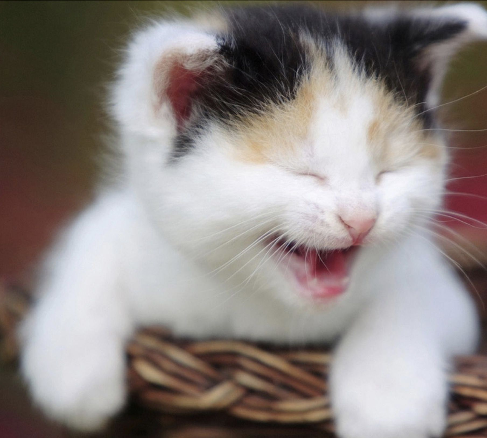

# ANIMAL JOKES

## CAUTION - Most hilarious jokes ever, please don't laugh too much.

> Why couldn't the two elephants go swimming?
>> Because they only had one pair of trunks between them.

> Why do squid swim in salt water?
>> Because pepper makes them sneeze.

>  How do you raise a baby elephant?
>> With a crane.

>  What runs around the forest making other animals yawn?
>> A wild boar.

> Did you hear about the emu that grew so big that it was shunned by the rest of its group?
>> It was ostrich sized.

> There were 20 cats in a plane. One jumped out. How many were left?
>> None, the others were copycats 